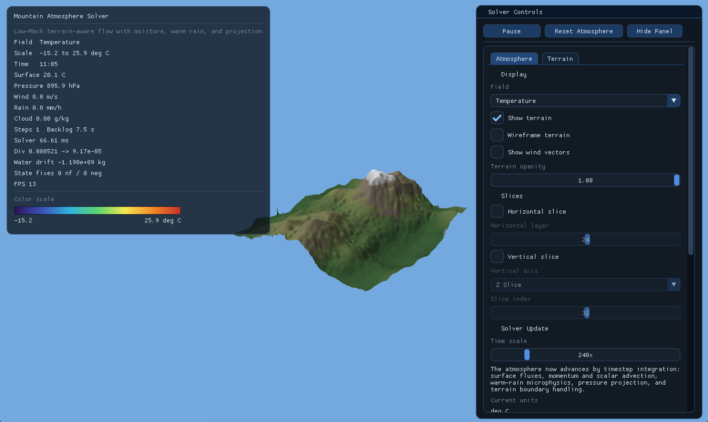
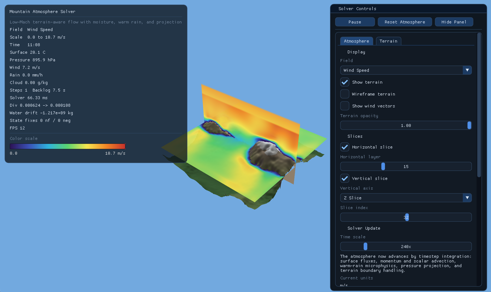

# 3D Mountains

This project currently focuses on the C application in [`C/main/main.c`](C/main/main.c): a procedural mountain terrain viewer with a terrain-aware atmosphere prototype, slice rendering, wind overlays, and an ImGui control panel.

## C App Overview

The C build combines three main parts:

- terrain generation with layered noise, hydraulic erosion, and a shaded mesh
- an atmosphere solver with staggered face velocities, scalar advection, warm-rain microphysics, pressure projection, and terrain masking
- a raylib + ImGui visualization layer for horizontal slices, vertical slices, solver stats, and camera controls

## Main C Files

- [`C/main/main.c`](C/main/main.c)  
  Main application loop, camera, UI, and system wiring.

- [`C/main/weather.c`](C/main/weather.c)  
  Weather simulation state, stepping, slice textures, and atmospheric rendering.

- [`C/main/terrain.c`](C/main/terrain.c)  
  Terrain generation, sampling, and terrain mesh rendering.

- [`C/save/main.c`](C/save/main.c)  
  Archived monolithic pre-refactor version kept for reference.

- [`C/build_weather.sh`](C/build_weather.sh)  
  Build script for the weather visualizer.

- [`third_party/cimgui`](third_party/cimgui)  
  Dear ImGui C bindings.

- [`third_party/rlImGui`](third_party/rlImGui)  
  raylib integration for ImGui.

## Build

The current build script expects raylib headers and libraries to be available from Homebrew paths on macOS.

```bash
brew install raylib
bash C/build_weather.sh
```

This produces:

```text
C/weather
```

## Run

```bash
./C/weather
```

## Controls

- `Left mouse drag`: orbit camera
- `Mouse wheel`: zoom
- `Space`: pause or resume the solver
- `R`: reset the atmosphere state
- `Tab`: cycle displayed field
- `H`: toggle horizontal slice
- `J`: toggle vertical slice
- `T`: toggle terrain
- `G`: hide or show the control panel

## Displayed Fields

The viewer can inspect:

- temperature
- pressure
- relative humidity
- dew point
- water vapor
- cloud water
- rain water
- wind speed
- vertical wind
- buoyancy


## Screenshots

### Main View




### Slice View


